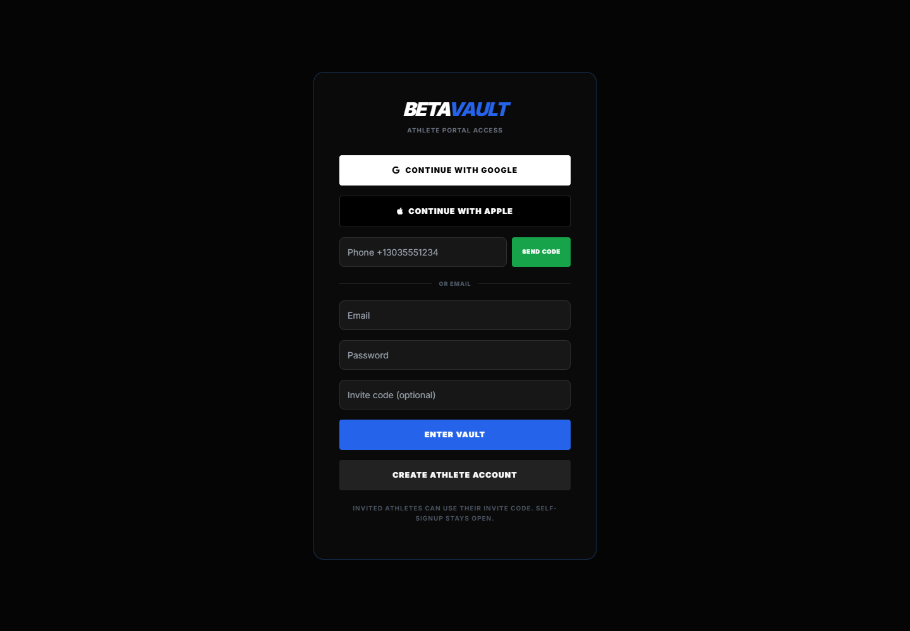

# BetaVault Coaching App

## Problem

Coaches and athletes need a shared place to track goals, training sessions, video feedback, and progress without scattering context across texts, spreadsheets, and camera rolls.

## Users

- Athletes logging goals, sends, sessions, and videos
- Coaches reviewing progress, notes, video timestamps, and priorities
- Admins managing roster, onboarding, roles, and notifications

## Key Features

- Athlete login/signup and coach/admin portal
- Google/Apple/email authentication direction
- Profile photos, max grade, grade conversion, and onboarding fields
- Training goals with comments, milestones, history, and AI recommendation concepts
- Session logging with templates for strength, climbing, bouldering, endurance, rest, technique, and projecting
- Coach-facing session reports
- Video upload/review workflows with timestamp notes and frame annotations
- Coach priority queue, roster, goals, notifications, and video review studio

## Technology Notes

- Static HTML/JS prototype
- Firebase client SDK direction for auth, Firestore, and Storage
- Role-based workflow model for coach and athlete experiences
- Designed for mobile athlete use and desktop coach review

## Screenshot

## Next Steps

- Finalize Firestore subcollection data model
- Add Firebase Security Rules and custom claims
- Add backend email/SMS notification provider
- Add AI recommendation approval queue with audit history
- Add automated tests around auth, role access, and save flows
