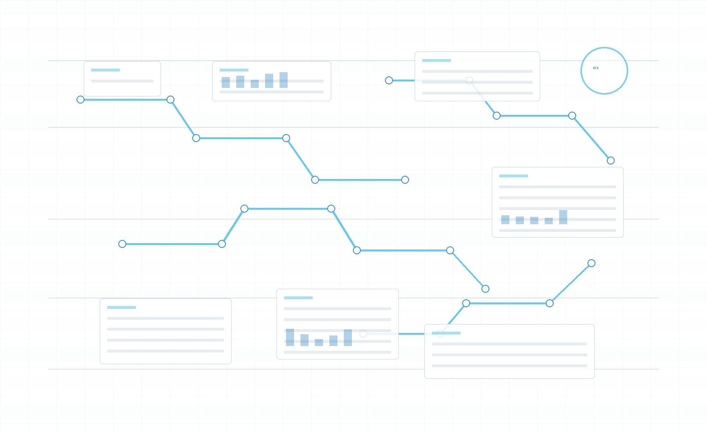

# Business App Portfolio

## Problem

Traditional resumes flatten broad IT and operations experience. This portfolio creates a visual, navigable body of work that shows deployed systems, strategic thinking, and application design.

## Users

- Hiring managers
- Recruiters
- Executive stakeholders
- Prospective clients

## Key Features

- Portfolio landing page and app gallery
- Strategic positioning around systems and deployed solutions
- Resume-aligned visual style and personal photography
- IT roadmap concept app
- Cognitive Bias Atlas entry point
- Case-study style app cards and screenshots

## Technology Notes

- Static HTML/CSS/JS
- Responsive portfolio layout
- Screenshot and media asset organization
- Designed to connect career narrative to working app examples

## Screenshot

## Next Steps

- Add short videos for each app
- Add GitHub Pages deployment link
- Add role-specific landing pages for IT PM, product owner, and strategic operations applications
- Add downloadable one-page case studies
