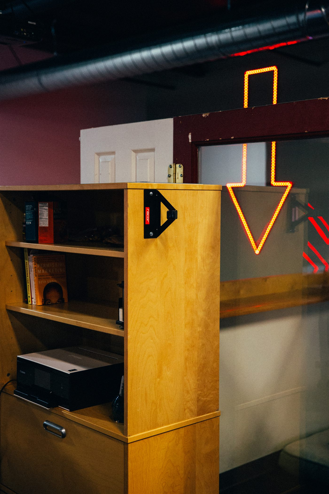

# Unfound Door Asset Launchroom

## Problem

Creative teams need a clean way to package images and videos for client review without exposing internal working files or overwhelming the client with production controls.

## Users

- Creative directors
- Photographers and videographers
- Clients reviewing delivered assets
- Social/media operations teams

## Key Features

- Asset-only client portal
- Image library and thumbnail-first browsing
- Client review jump links
- Lightweight crop presets for social formats
- Video review direction with mark-in and mark-out concepts
- Slim client experience separated from internal controls

## Technology Notes

- Static HTML/CSS/JS
- Local manifest-driven asset library
- Raw full-size media excluded from this repository
- Demonstrates UX thinking around client delivery and media workflow

## Screenshot

## Next Steps

- Replace local assets with cloud storage URLs
- Add secure client links and expiration dates
- Add approval/download states
- Add real video transcoding and preview generation
- Add social post export integrations
