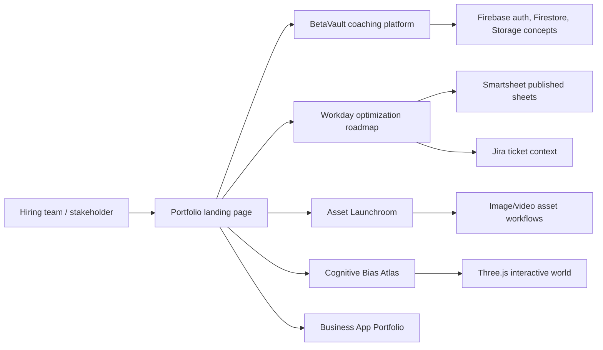
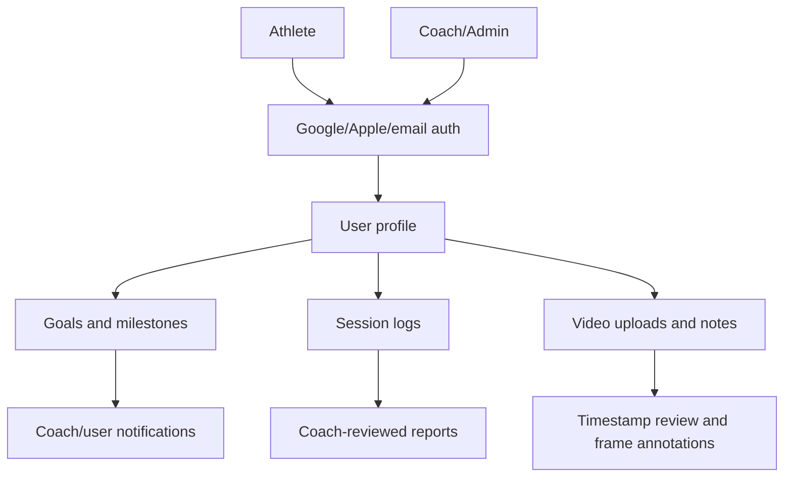
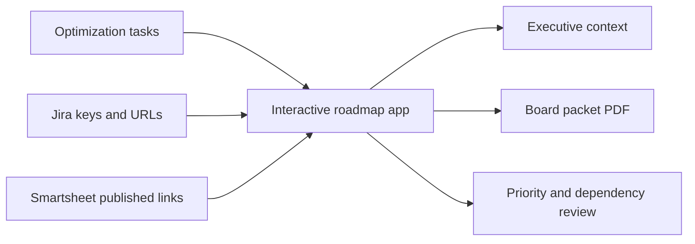
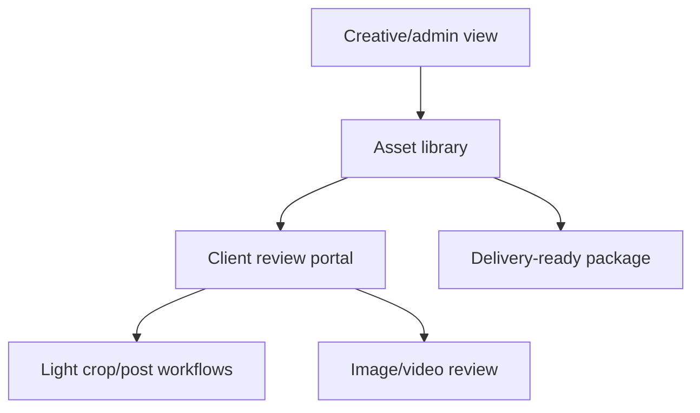
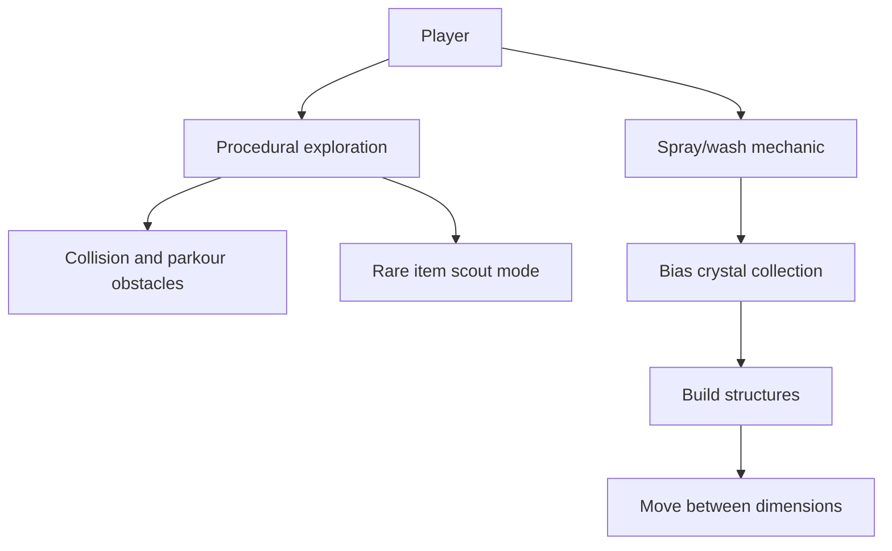

# Architecture Overview

This portfolio uses small, inspectable web apps to demonstrate product thinking, workflow design, and systems integration. Most apps are static front-end prototypes because the focus is on decision flow, stakeholder experience, data shape, and implementation direction.

## Portfolio-Level Map

## BetaVault Coaching App

Key architecture idea: model user-owned data around athletes, with coach-facing review workflows layered on top.

## Workday Optimization Roadmap

Key architecture idea: turn a long task list into an executive decision tool with traceability to systems of record.

## Asset Launchroom

Key architecture idea: separate internal library management from a very slim client review experience.

## Cognitive Bias Atlas Game

Key architecture idea: teach abstract cognitive concepts through spatial exploration and progression loops.
